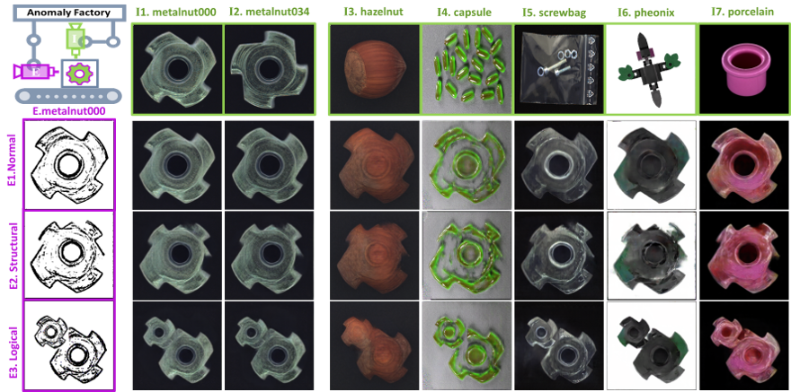

# Butterfly Hybrid Generation based on AnomalyFactory
### [Paper](https://arxiv.org/abs/2408.09533) <br>
PyTorch implementation of butterfly hybrid generation referring to the paper: "AnomalyFactory: Regard Anomaly Generation as Unsupervised Anomaly Localization" (ECCV 2024 workshop on Vision-based InduStrial InspectiON (VISION)).  
___


Illustrations of scalable anomaly generation of proposed AnomalyFactory. The reference color image(I) provides texture content for the generation while the target edge map(E) controls the skeleton of generated object. By manipulating the target edge maps, AnomalyFactory generates normal(E1) samples and structural(E2) and logical(E3) anomalies. We further demonstrate its scalable ability by using reference color images from 5 different datasets, including MVTecAD (I1-I3), VisA (I4), MVTecLOCO (I5), MADSim (I6) and RealIAD (I7).
___

> **AnomalyFactory: Regard Anomaly Generation as Unsupervised Anomaly Localization**<br>
> Ying Zhao<br>
> https://arxiv.org/abs/2408.09533 <br>
>
>**Abstract:** Recent advances in anomaly generation approaches alleviate the effect of data insufficiency on task of anomaly localization. While effective, most of them learn multiple large generative models on different datasets and cumbersome anomaly prediction models for different classes. To address the limitations, we propose a novel scalable framework, named AnomalyFactory, that unifies unsupervised anomaly generation and localization with same network architecture. It starts with a BootGenerator that combines structure of a target edge map and appearance of a reference color image with the guidance of a learned heatmap. Then, it proceeds with a FlareGenerator that receives supervision signals from the BootGenerator and reforms the heatmap to indicate anomaly locations in the generated image. Finally, it easily transforms the same network architecture to a BlazeDetector that localizes anomaly pixels with the learned heatmap by converting the anomaly images generated by the FlareGenerator to normal images. By manipulating the target edge maps and combining them with various reference images, AnomalyFactory generates authentic and diversity samples cross domains. Comprehensive experiments carried on 5 datasets, including MVTecAD, VisA, MVTecLOCO, MADSim and RealIAD, demonstrate that our approach is superior to competitors in generation capability and scalability.

## Citation
If you find this useful for your research, please use the following.

```
@article{DBLP:journals/corr/abs-2408-09533,
  author       = {Ying Zhao},
  title        = {AnomalyFactory: Regard Anomaly Generation as Unsupervised Anomaly
                  Localization},
  journal      = {CoRR},
  volume       = {abs/2408.09533},
  year         = {2024},
  url          = {https://doi.org/10.48550/arXiv.2408.09533},
  doi          = {10.48550/ARXIV.2408.09533},
  eprinttype    = {arXiv},
  eprint       = {2408.09533},
  timestamp    = {Mon, 30 Sep 2024 13:54:02 +0200},
  biburl       = {https://dblp.org/rec/journals/corr/abs-2408-09533.bib},
  bibsource    = {dblp computer science bibliography, https://dblp.org}
}
```


## Acknowledgments
 - This code borrows from [DeepSIM](https://github.com/eliahuhorwitz/DeepSIM), [pix2pixHD](https://github.com/NVIDIA/pix2pixHD).
