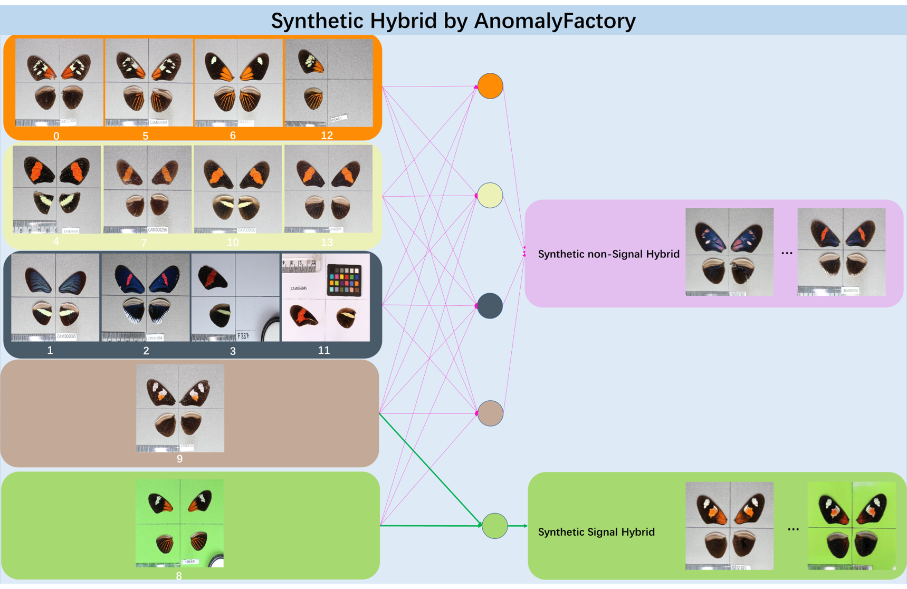

# Butterfly Hybrid Detection based on AnomalyFactory

[Challenge](https://www.codabench.org/competitions/3764/) | [AnomalyFactory](https://arxiv.org/abs/2408.09533)
## Overview
We propose a solution for [Butterfly Hybrid Detection Challenge](https://www.codabench.org/competitions/3764/) based on the [AnomalyFactory](https://arxiv.org/abs/2408.09533) that is an unsupervised anomaly generation framework. The Butterfly Hybrid Detection Challenge provides a [training set](https://www.codabench.org/competitions/3764/#/pages-tab) consisting of 1,991 non-hybrid and 91 hybrid images and a [butterfly_anomaly_train.csv](https://github.com/Imageomics/HDR-anomaly-challenge/blob/main/files/butterfly_anomaly_train.csv) file that reveals the subspecies ID of all images. Based on the challenge training set, we train two generative models, AF4hybrid and AF4nonhybrid, to generate 8,874 hybrid and 1,991 non-hybrid images respectively. With the challenge training set and generated images, totally 12,974 images, we use DINOV2 to extract the representative features and further train a sgd classifier sgd_clf.pkl and a linear classifier clf1024.pth. The final result combines the predictions of these two classifiers.
## Structure of this Repository
Refer to the [challenge samples](https://github.com/Imageomics/HDR-anomaly-challenge-sample), this repository provides training and testing resource both for the butterfly hybrid detection (HybridDetection) and generation (AnomalyFactory). Our submission for the challenge is dino2B_contestAF_1024linear2cls. 
Note: The HybridDetection is independent from the AnomalyFactory that is provided for reproducing the image generative models. 
```
AF4ButterflyHybridDetection
├── HybridDetection
│   ├── requirements.txt
│   ├── submission
│   │   └──dino2B_contestAF_1024linear2cls
│   │       ├── ImageSamples
│   │       │   ├── CAM016049.jpg
│   │       │   └── 15N016.jpg
│   │       ├── ingestion.py
│   │       ├── metadata
│   │       ├── model.py
│   │       └── requirements.txt
│   └── train
│       ├── classifier.py
│       ├── data_utils.py
│       ├── dataset.py
│       ├── evaluation.py
│       ├── classifier.py
│       ├── model_utils.py
│       └── training.py
│
├── AnomalyFactory/...
├── Models
│   ├── classifiers
│   └── AFgenerators
│      ├── AF4nonhybrid
│      └── AF4hybrid
└── Datasets
    ├── Images4TrainClassifier
    ├── Images4TrainAFnonhybrid
    └── Images4TrainAFhybrid
```
## Butterfly Hybrid Detection
### Testing 
1. Download trained sgd classifier sgd_clf.pkl and linear classifier clf1024.pth from https://drive.google.com/file/d/1Un188eNc8Nit644ZAzcOYwUoA3Dfh1TE/view?usp=drive_link.  
2. Put the downloaded sgd_clf.pkl and clf1024.pth into path: Models/classifiers/  
3. Run testing images with the classifiers. Note: For quick test, the default pathes are set as input_dir = ImageSamples/ and output_dir = './' . Please modify them in ingestion.py if needed.  
```bash
   cd HybridDetection\submission\dino2B_contestAF_1024linear2cls
   python ingestion.py
```
4. Output: predictions.txt
### Training
1. Download training data (Images4TrainClassifier) from https://drive.google.com/file/d/1MLIP8gbKVm_A0a5HTowBvfzsuRk7j37u/view?usp=drive_link. Images4TrainClassifier consists of original challenge images and the images(filename:AF_*.png) generated by AnomalyFactory.  
The structure of downloaded folder is shown below. 
```
   Images4TrainClassifier
    ├── Images
    │   ├── hybrid/...
    │   └── non-hybrid/...
    └── Lists
        └── butterfly_anomaly_AF.csv
```
2. Put the downloaded Images4TrainClassifier into path: Datasets/
3. Run training classifiers.
```bash
   cd HybridDetection\train
   python training.py
```
Note: The sgd classifier and linear classifier will be trained successively.
The default setting in training.py is shown below.
```
ROOT_DATA_DIR = Path("../../Datasets/Images4TrainClassifier")
CSV_DIR = Path("../../Datasets/Images4TrainClassifier")
DATA_FILE = CSV_DIR / "List" / "butterfly_anomaly_AF.csv"  
IMG_DIR = ROOT_DATA_DIR / "Images"
CLF_SAVE_DIR = Path("../submission/dino2B_contestAF_1024linear2cls") 
CTN_SAVE_DIR = Path("../submission/dino2B_contestAF_1024linear2cls")
```
## Butterfly Hybrid Generation

### Testing
1. Download hybrid generative model from [AF4hybrid](https://drive.google.com/file/d/1-D06R7eiCF6mlCsELzopHlmsCMWhlmsQ/view?usp=drive_link).
Download non-hybrid generative model from [AF4nonhybrid](https://drive.google.com/file/d/12duO1fsfuhVmBzuf0ll9n2lgiKtBsoiL/view?usp=drive_link).
2. Put the downloaded generators into path: Models/AFgenerators/  
The structure of downloaded folder is shown below.  
```
Models
│
├── AFgenerators
│   ├── AF4nonhybrid
│   │   ├── latest_net_G.pth
│   │   └── latest_net_D.pth
│   └── AF4hybrid
│       ├── latest_net_G.pth
│       └── latest_net_D.pth
│
└── classifiers
    ├── clf1024.pth
    └── sgd_clf.pkl
```
Note: The edge maps are extracted by the pre-trained [PidiNet](https://github.com/hellozhuo/pidinet).  
3. Download data (Images4TrainAFnonhybrid) for testing from https://drive.google.com/file/d/1Fk41aXh9n02roX57ynnUip069Hc3amWv/view?usp=drive_link.  
4. Put the downloaded Images4TrainAFnonhybrid into path: Datasets/  
The structure of downloaded folder is shown below.
```
Datasets
├── Images4TrainAFnonhybrid
│   ├── Images
│   │   ├── 0/...
│   │   ├── ...
│   │   └── 13/...
│   └── Lists
│       ├── train_AFnonhybrid/...
│       ├── test_nonsignalhybrid/...
│       ├── train_signalhybrid/...
│       └── test_nonhybrid/...
```
5. Run generating non-hybrid images. It will generates images according to file names list in test_nonhybrid/test_color_ref.txt and test_nonhybrid/test_edges.txt.  
Please modify the following parameters in test_AF4nonhybrid.sh if needed.  
```
--dataroot ./Datasets/Images4TrainAFnonhybrid/List/test_nonhybrid/ 
--how_many 5 #The number of testing images
--gpu_ids 0 
--results_dir ./results/butterflyContest/nh/ #The savepath
```
Then, run  
```bash
   cd AnomalyFactory
   ./scripts/test_AF4nonhybrid.sh
```
6. Run generating non-signal hybrid images.   
Please modify the following parameters in test_AF4hybrid.sh if needed.  
```
--dataroot ./Datasets/Images4TrainAFnonhybrid/List/test_nonsignalhybrid/ 
--how_many 5 #The number of testing images
--gpu_ids 0 
--results_dir ./results/butterflyContest/nsh/
```
Then, run  
```bash
   cd AnomalyFactory
   ./scripts/test_AF4hybrid.sh
```
7. Run generating signal hybrid images.   
Please modify the following parameters in test_AF4hybrid.sh.  
```
--dataroot ./Datasets/Images4TrainAFnonhybrid/List/test_signalhybrid/ 
--how_many 5 #The number of testing images
--gpu_ids 0 
--results_dir ./results/butterflyContest/sh/
```
Then, run  
```bash
   cd AnomalyFactory
   ./scripts/test_AF4hybrid.sh
```
### Training
1. Download training data (Images4TrainAFhybrid) from https://drive.google.com/file/d/1UUqLajOSo1faw_tE_JkWMMKvl_Ck6xdJ/view?usp=drive_link.  
2. Put the downloaded Images4TrainAFhybrid into path: Datasets/    
The structure of downloaded folder is shown below.  
```
Datasets
├── Images4TrainAFhybrid
│   ├── Images
│   │   ├── hybrid/...
│   │   └── non-hybrid/...
│   └── Lists
│       └── train_AFhybrid/...
```
Note: Images4TrainAFhybrid and Images4TrainAFnonhybrid both contain only challenge images but with 500x333 and 256x256 resolutions respectively.  
3. Run training hybrid generator.  
```bash
   cd AnomalyFactory
   ./scripts/train_AF4hybrid.sh
```
4. Run training non-hybrid generator.  
```bash
   cd AnomalyFactory
   ./scripts/train_AF4nonhybrid.sh
```

## Pre-trained models
Download pre-trained models (optional)
   [Edge extractor: PidiNet](https://github.com/hellozhuo/pidinet), [Feature extractor: DINOv2](https://github.com/facebookresearch/dinov2)

## Citation
If you find this useful for your research, please use the following.

```
@article{DBLP:journals/corr/abs-2408-09533,
  author       = {Ying Zhao},
  title        = {AnomalyFactory: Regard Anomaly Generation as Unsupervised Anomaly
                  Localization},
  journal      = {CoRR},
  volume       = {abs/2408.09533},
  year         = {2024},
  url          = {https://doi.org/10.48550/arXiv.2408.09533},
  doi          = {10.48550/ARXIV.2408.09533},
  eprinttype    = {arXiv},
  eprint       = {2408.09533},
  timestamp    = {Mon, 30 Sep 2024 13:54:02 +0200},
  biburl       = {https://dblp.org/rec/journals/corr/abs-2408-09533.bib},
  bibsource    = {dblp computer science bibliography, https://dblp.org}
}
```
